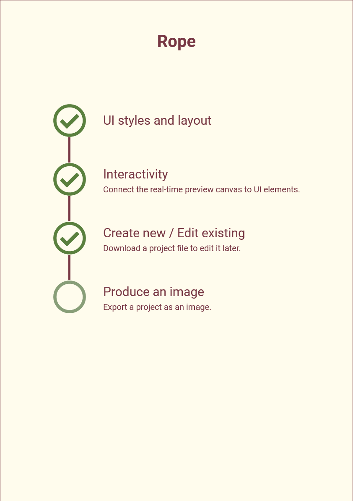

# Rope (editor)
Rope is a web application for creating and editing simple roadmaps.
The roadmaps' styles can be customized, although not much.

# Our roadmap


# Demo video
Video Sections:
1. Create a new project and save it.
2. Open the created project for editing.


# Resolve Dependencies
In the root directory of the project, run this command:

```bash
npm i
```

# Deploy to firebase hosting
The firebase cli must be logged in.

1. Prepare the *public* directory:
```bash
./deploy-prep.sh
```

2. Delpoy the app
```bash
firebase deploy
```